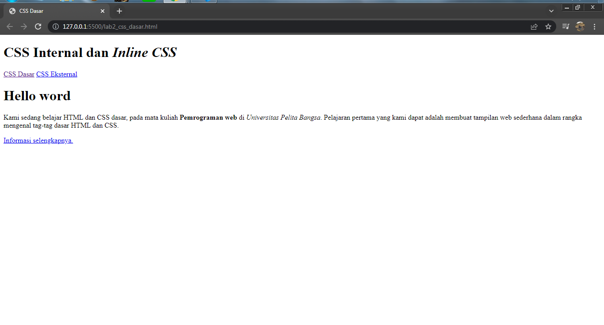
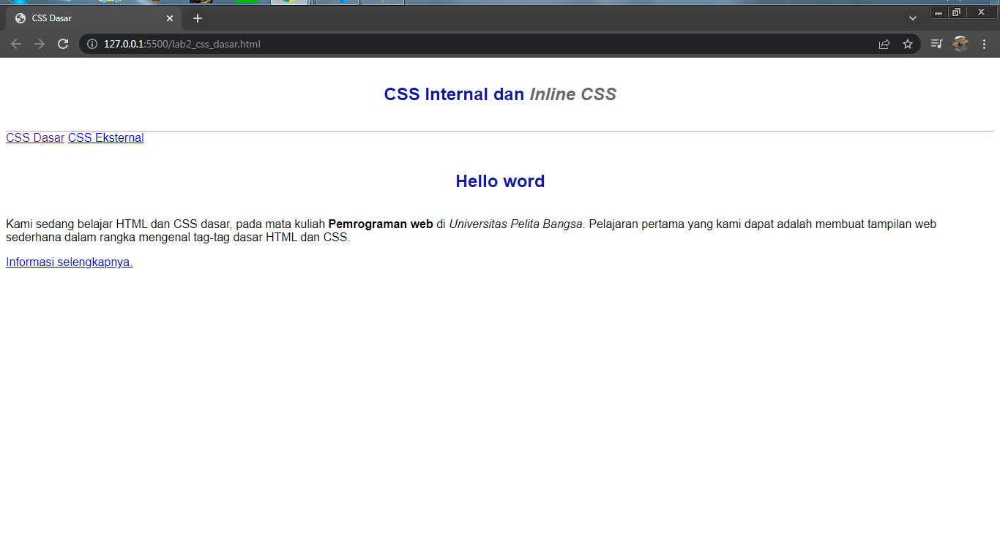
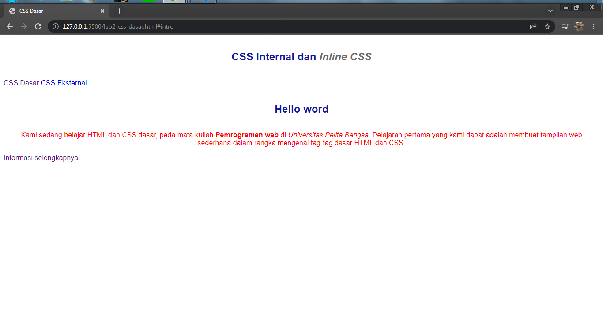
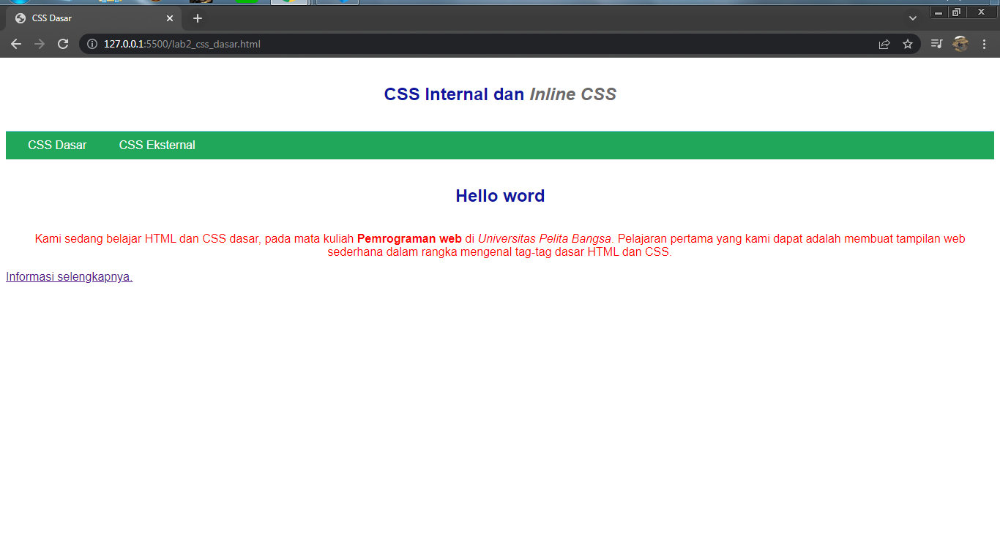
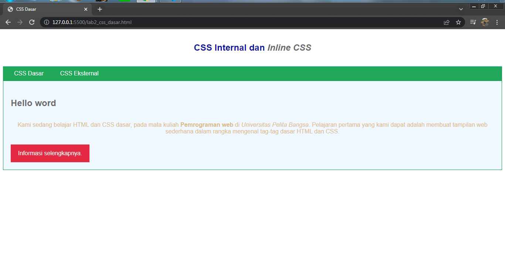
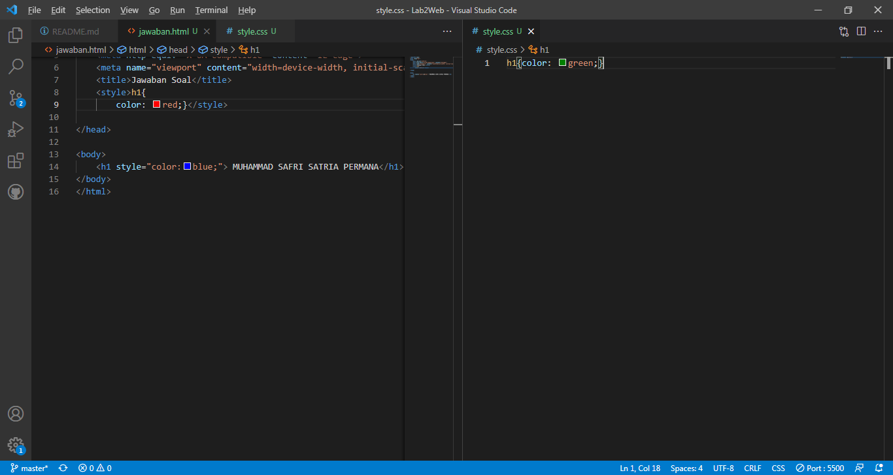
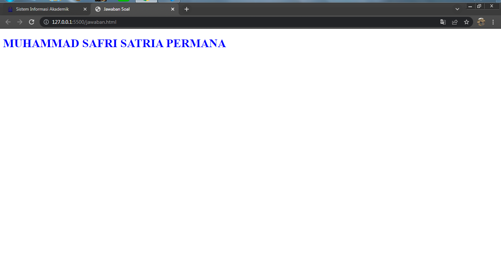
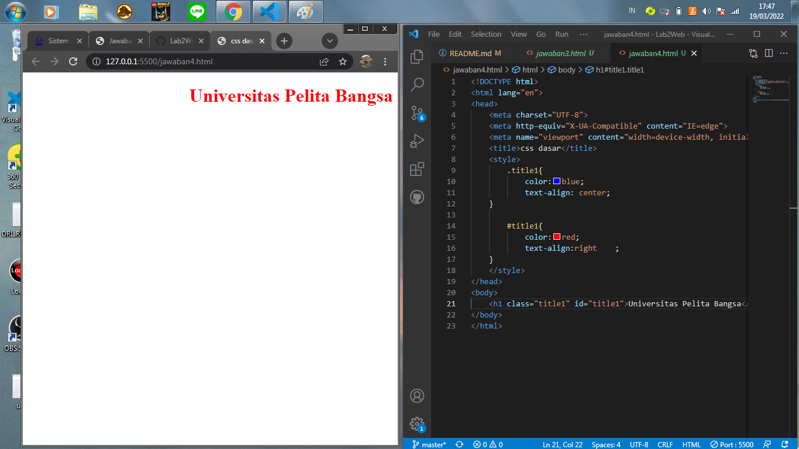

# Tugas Lab 2 Web Pertemuan 3
## Profil
| Biodata |  Pembuat|
| -------- | --- |
| **Nama** | Muhammad Safri Satria Permana |
| **NIM** | 312010337 |
| **Kelas** | TI.20.A.2 |
| **Mata Kuliah** | Pemrograman Web |
## Langkah 1

1. Membuat Dokumen HTML Dengan nama `lab2_css_dasar.html`.

2. Lalu buat struktur dasar HTML.
```html
<!DOCTYPE html>
<html lang="en">
<head>
    <meta charset="UTF-8">
    <meta http-equiv="X-UA-Compatible" content="IE=edge">
    <meta name="viewport" content="width=device-width, initial-scale=1.0">
    <title>CSS Dasar</title>
</head>
<body>
    <header>
        <h1>CSS Internal dan <i>Inline CSS</i></h1>
    </header>
    <nav>
        <a href="lab2_css_dasar.html">CSS Dasar</a>
        <a href="lab2_css_eksternal.html">CSS Eksternal</a>
    </nav>
    <!-- CSS ID Selector -->
    <div id="intro">
        <h1>Hello word</h1>
        <p>Kami sedang belajar HTML dan CSS dasar, pada mata kuliah <b>Pemrograman web</b> di <i>Universitas Pelita Bangsa</i>. Pelajaran pertama yang kami dapat adalah membuat tampilan web sederhana dalam rangka mengenal tag-tag dasar HTML dan CSS.</p>
        <!-- CSS Class Selector -->
        <a class="button btn-primary" href="#intro">Informasi selengkapnya.</a>
    </div>
</body>
</html>
```

Maka hasilnya akan seperti berikut.

 
## Langkah 2 `Mendeklarasikan CSS internal`
1. Tambahkan kode berikut kedalam head HTML.

```html
<!-- CSS Internal -->
  <style>
    body {
      font-family: 'Open Sans', sans-serif;
    }

    header {
      min-height: 80px;
      border-bottom: 1px solid #77CCEF;
    }

    h1 {
      font-size: 24px;
      color: #0F189F;
      text-align: center;
      padding: 20px 10px;
    }

    h1 i {
      color: #6d6a6b;
    }
  </style>  
  ```

  2. Maka hasilnya akan seperti berikut.

  

  ## Langkah 3 `Menambahkan Inline CSS`
  1. Tambahkan kode berikut kedalam tag `<p>`.
  ```html
<p style="text-align: center; color: #ccd8e4;">
```

2. Maka hasilnya akan seperti berikut.


## Langkah 4 `membuat CSS Eksternal`
1. Buat file baru bernama `style_eksternal.css`.
2. Deklarasikan kode berikut ke dalamnya.
```css
nav {
  background: #20A759;
  color:#fff;
  padding: 10px;
}

nav a {
  color: #fff;
  text-decoration: none;
  padding:10px 20px;
}

nav .active, nav a:hover {
  background: #0B6B3A;
}
```

3. Sisipkan tag `<link>` untuk menghubungkan antara file HTML dengan file CSS dibagian `<head>`.

```html
<!-- menyisipkan css eksternal -->
<link rel="stylesheet" href="style_eksternal.css" type="text/css">
```
> Apabila tidak menambahkan tag ini maka html tidak akan mendapatkan stylenya/tidak valid.
4. Maka hasilnya akan seperti berikut.


## Langkah 5 `Menambahkan CSS Selector`
1. Tambahkan Selector menggunakan  _ID_ dan _Class_ pada file `style_eksternal.css`.
```css
/* ID Selector */

#intro {
    background: #418fb1;
    border: 1px solid #099249;
    min-height: 100px;
    padding: 10px;
}

#intro h1 {
    text-align: left;
    border: 0;
    color: #fff;
}

/* Class Selector */
.button {
    padding: 15px 20px;
    background: #bebcbd;
    color: #fff;
    display: inline-block;
    margin: 10px;
    text-decoration: none;
}

.btn-primary {
    background: #E42A42;
}
```

2. Maka hasilnya setelah saya modifikasi sedikit akan seperti berikut.


> ### Hasilnya Jadi Lebih Menarik


## Pertanyaan dan Tugas 
```
1. Lakukan eksperimen dengan mengubah dan menambah properti dan nilai pada kode CSS
dengan mengacu pada CSS Cheat Sheet yang diberikan pada file terpisah dari modul ini.
2. Apa perbedaan pendeklarasian CSS elemen h1 {...} dengan #intro h1 {...}? berikan
penjelasannya!
3. Apabila ada deklarasi CSS secara internal, lalu ditambahkan CSS eksternal dan inline CSS pada
elemen yang sama. Deklarasi manakah yang akan ditampilkan pada browser? Berikan
penjelasan dan contohnya!
4. Pada sebuah elemen HTML terdapat ID dan Class, apabila masing-masing selector tersebut
terdapat deklarasi CSS, maka deklarasi manakah yang akan ditampilkan pada browser?
Berikan penjelasan dan contohnya! ( <p id="paragraf-1" class="text-paragraf"> )

## Jawaban Soal dan Pertanyaan
```
1. Seperti pada gambar saya mengubah warna font dan font-family dengan Arial Black, dan memberikan perubahan di bagian button di css dengan menambahkan ``{border-style:outset;
border-radius: 10px;}``
2. pendeklarasian CSS #intro h1{..} adalah dengan menggunakan selector id, sedangkan h1{..} tidak menggunakan selector.
3. Ketika kita mendeklarasikan secara bersamaan antara ***INTERNAL, EKSTERNAL*** dan ***INLINE***, yang akan ditampilkan pada Browser adalah ***INLINE***. Karena ***INLINE*** Memiliki deklarasi prioritas dibanding ***EKSTERNAL*** atau pun ***INTERNAL***, seperti contoh yang saya buat, saya membuat dokumen baru HTML kemudian saya buat Elemen ``{h1}`` yang kemudian saya akan deklarasikan di CSS ***INTERNAL, EKSTERNAL*** dan juga ***INLINE*** Dengan property ``{color}`` yang berbeda, jika ***INTERNAL*** ``{color: red}``, sementara ***EKSTERNAL*** ``{color:green;}`` dan ***INLINE*** ``{color: blue;}``. Maka yang terpanggil di browser adalah ***INLINE*** karena memiliki prioritas.



**Hasil Deklarasinya**


4. Maka yang ditampilkan pertama adalah **ID**, karena **ID** adalah hitungan poin selector yang lebih besar daripada **Class**.



